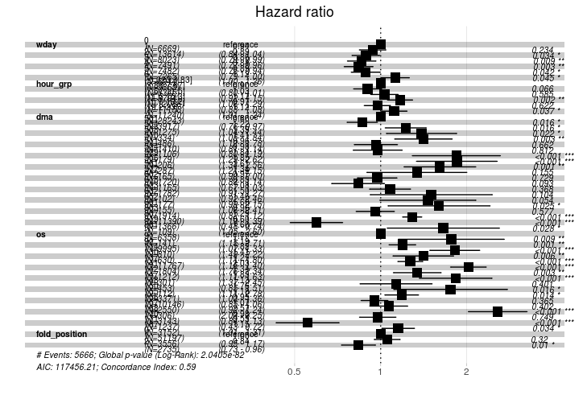

```{r setup, include=FALSE}
knitr::opts_chunk$set(echo = FALSE)
```

## About Me

* Life: Originally from Sacramento, ended up out here for grad school.

* School: Sociology  
    - Not that much of a leap from social science to data science
    - Which factors influence social outcomes -> which factors influence marketing outcomes

* Work: Data Science/Analytics  

    * Express - Customer Marketing 
    * The Shipyard - Advertising/Digital Marketing/Measurement
    * Columbus Collaboratory - General Data Science/Cyber Security

## Topics

1. Privacy in Digital Marketing

2. My experince with Data in Marketing  

    * Programmable Media
    * Marketing Attribution

## Privacy

My reaction to most of the videos:


## Privacy

These are important issues, but it's much less nefarious than they make it sound.

What they say:

* ALGORITHMS are MANIPULATING what you see on the INTERNET. Diet companies FEED you information to make you feel BAD about yourself and then PREY on you with ADVERTISEMENTS

What actually happens:

* Company/Ad Agency: We should try to get our product in front of our target audience.

## What Data is being Captured

1st Party Data: 

* You visit a site, they create a cookie for you, and track what you do on the site (e.g. which pages did you visit, did you fill a cart or make a purchase?)  

    * Simple information, but covers most of all site visitors

## What Data is being Captured

3rd Party Data:

* Companies buying lists of people who have a certain characteristics, interests, and/or demographics  
    
    * Most commonly information on what other sites you visit  
    * BUT can come from credit bureaus or credit card companies
    * Deep information, but has limited coverage on your users (matching is hard)


## Privacy

Most first party data can be cleared if you delete your cookies and/or browse in incognito.

The bigger ethical issue is how these third party audiences are created.  

As we saw with Equifax, when they're collecting this data, it can be stolen.

At the agency level, you're mostly buying an ID match - typically based on an email match.

* Sometimes you don't even get the data.

## Limited Useability of 3rd Party Data

I've heard estimates that the accuracy of these 3rd party audiences is as low at 50%

The more specific a 3rd party audience is, the fewer (potential) customers in applies to.

So, for the scenario described in the IBM video to occur, an advertiser has to have access to accurate data with substantial coverage and the ability/competence to effectively action on that data. 

It's less 'Let's make Becky feel awful about herself so she'll buy our stuff' and more 'Let's get our ads in front of people who've search for dieting or purchased weight loss plans in the past'

## Why I think this way

My biases:

* I work with data for a living

* I've never really sold anything controversial

* To me, annoying != violation of privacy

## Privacy Summary

Overall, there are definitely things to think about, and be concerned about.

But, in my experience on the agency and company end, the advertising fearmongering is overblown.

The main concern I have is data security with companies collecting sensitive data. 

Advertising may play a role in *why* they collect such data, but it's not the only reason. Background checks, non-traditional loan applications, and the general idea of 'if we can collect it, we should collect it.'


**Questions?**

## Data in Marketing: Programmable Media

How do you end up seeing the ads you see? **Auctions!**

How does a company know what to bid on?

* Impression Factors: Time of Day, Location, Publisher, Device Type

* 1st Party Data & 3rd Party Data

This was one of my main duties at The Shipyard: apply machine learning/statistical models to this data to figure out a more efficient bidding strategy

## Programmable Media: Baseline

Most ad campaigns are built with a uniform CPM (Cost per Thousand Impressions)  

However, not all impressions are created equal  

* Do you want to bid the same for a desktop impression at 6 pm and for a mobile impression at 2 am? 

* For a lawn care company, do you want to bid the same in Ohio and Florida in January?


## Programmable Media

What do you need to figure out?

* Not only who to bid more on, but how much more to bid

This can be done manually, but only on a very limited scale.

If you want to build bid logic just for state, hour, and mobile/desktop, that's `r scales::comma(24*50*2)` combinations

Statistics/Machine Leaning can be a better way!

* Build a model predicting conversion (site visit/cart fill/purchase), estimate a combination's likelihood of conversion, and use that to inform your bid logic.


## Programmable Media: Hazard Ratios



## Programmable Media

Example Cases:

  * An impression on Monday, between 12 and 3 pm, in DMA 807, using OS 137, above the fold would get a modification of `r .9075 * 1.1452 * 1.3322 * 1.136 * 1.0229`
  
  * An impression on Wednesday, between 4 and 7 am, in DMA 501, using OS 157, below the fold would get a modification of `r .8035 * .8783 * .8202 * .8021 * .8133`

**Questions?**


## Marketing Attribution

How much ROI am I getting on my advertising? Simple Question, right?


## Marketing Attribution: Problem

Scenario: I am served an email, a display ad, and a facebook ad for a company (In that order), I then make a purchase from that company

Problem: How is the credit allocated?

## Marketing Attribution: Explanations

Vendors  

* The email, display ad, and facebook vendors all take 100% credit for the conversion. Your 1 purchase is actually 3 purchases!

Heuristic

* Last Touch: The Facebook Ad gets 100% credit for the conversion 

* First Touch: The email gets 100% credit for the conversion 

* Linear Touch: Each tactic gets 1/3 credit for conversion  

## Marketing Attribution

What's wrong with these explanations?

* Vendors only care about making themselves look good

* Hueristic models try to allocate 100% credit to marketing.

* Not causal.

## Statistical Attribution

Counterfactuals

* How do outcomes differ when a channel is removed 

    - The difference in performance between people who got an email and a display ad, and the people who just got an email is likely attributable to the display ad  
    
    - Markov Chain, Shapely Value (Game Theory), Survival Analysis
    
Experiments

  - Hold a group out from recieving a marketing channel and measure the difference  
  
  - A/B Testing
  
## Statistical Attribution
    
Non-Marketing behavior

* Account for factors like previous transactions, time of year, and shopping cycle

Unmeasured behavior

* Conversations with friends/family/colleagues, listening to a podcast ad, etc.  

  - Embrace Uncertainty!


## Marketing Attribution - Conclusion

Simple, important question, VERY hard to answer

* There's no ground truth

* There's no single best method

* Need user leve data (Social media companies often don't provide)

Have to manage organizational politics as well

* Budget == Livelihood for tactic mangers

**Questions?**


